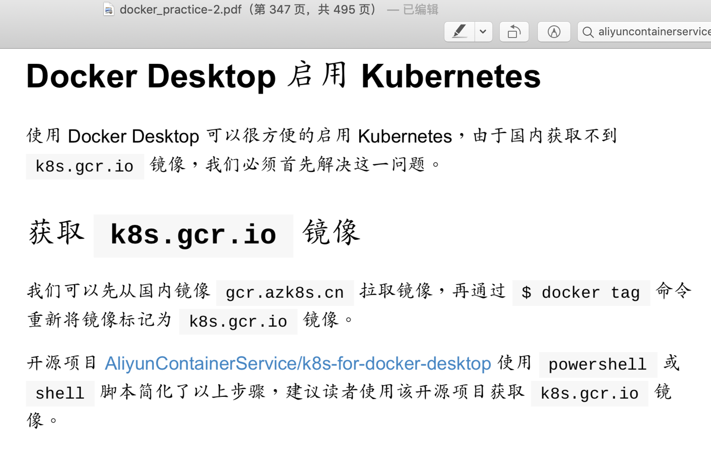

# 国内安装k8s的方法

[kubeasz](https://github.com/easzlab/kubeasz)      
[Bootstrap-Kubernetes-with-QEMU](https://github.com/zimmertr/[Bootstrap-Kubernetes-with-QEMU)   
[docker的一些概念](https://zhangguanzhang.github.io/2018/01/10/docker的一些概念/)

- 通过阿里云提供的镜像安装k8s
