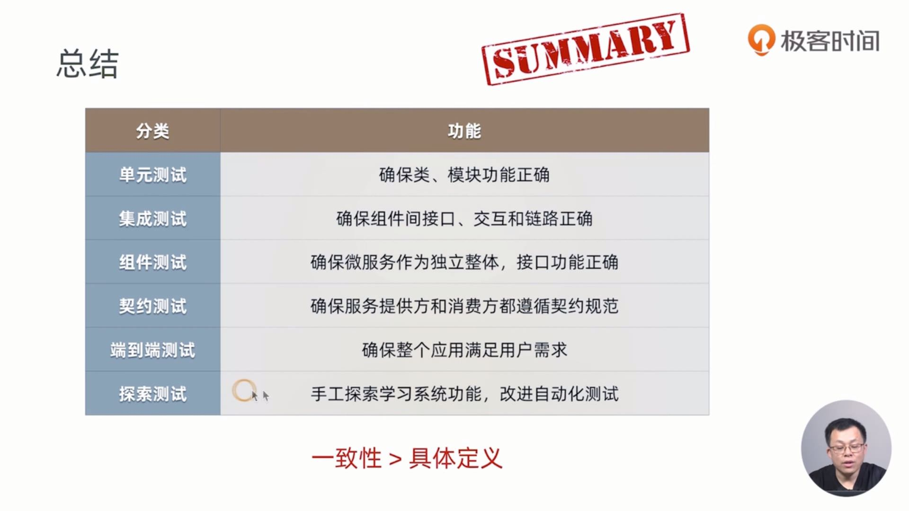

# 微服务的技术选型和从单体应用到微服务的重构路线

Staffjoy 公司和案例背景

Staffjoy曾经是美国硅谷的一家初创公司，成立于 2015 年，创始人是Philip I. Thomas，公司曾获得 Y Combinator 等知名机构的投资。Staffjoy 的主要业务是为小企业提供工时排班(Scheduling)软件解决方案，帮助企业提升雇员管理效率，主要面向零售、餐饮等服务行业。因业务发展和招聘等原因，Staffjoy 公司最终于 2017 年关闭，在关闭前，公司把核心产品大部分都开源贡献给了 Github 社区。Staffjoy V2是公司关闭前研发的最新一款 SaaS 版企业排班系统，目前在 Github 上有超过 1k 星，总体设计和代码质量较高，目前有不少企业在定制使用。Staffjoy V2 是一个小规模 SaaS 应用，采用微服务和前后分离架构，支持 Kubernetes/GKE 容器云环境一键部署，是学习现代 SaaS、微服务和云原生架构的一个模版项目。

通过对业务接口的流量的拦截和处理，istio可以实现service mesh，但采用istio mixer会显著增加资源消耗。

当新的数据存储需要一个连续页面为 3 的配置时，旧的算法需要从 freelist 头开始扫描，最后返回页面起始 ID 为 47，以此可以看到普通的 etcd 线性扫描内部 freelist 的算法，在数据量较大或者是内部碎片严重的情况下，性能就会急速的下降。

针对这一问题，我们设计并实现了一个基于 segregated hashmap 新的 freelist 分配回收算法。该算法将连续的页面大小作为 hashmap 的 key，value 是起始 ID 的配置集合。当需要新的页面存储时，我们只需要 O(1) 的时间复杂度来查询这个 hashmap 值，快速得到页面的起始 ID。

再去看上面例子，当需要 size 为 3 的连续页面的时候，通过查询这个 hashmap 很快就能找到起始页面 ID 为 47。

同样在释放页面时，我们也用了 hashmap 做优化。例如上图当页面 ID 为 45、46 释放的时候，它可以通过向前向后做合并，形成一个大的连续页面，也就是形成一个起始页面 ID 为 44、大小为 6 的连续页面。

