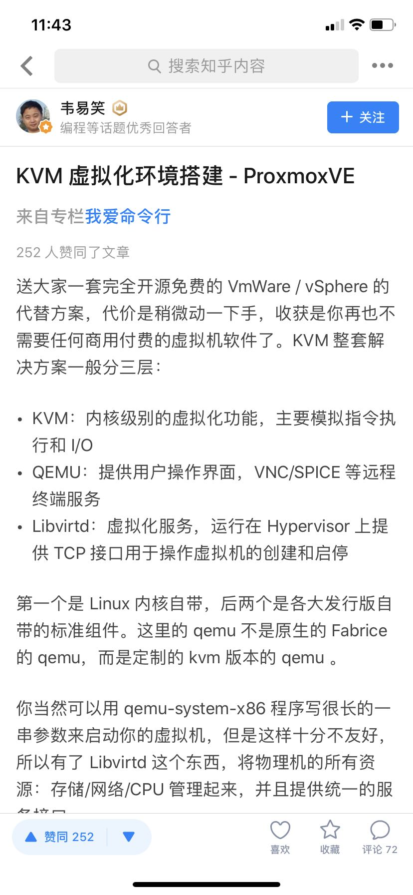

# 搭建自有的云服务平台

- 最新的 qemu 的源代码的仓库(https://git.qemu.org/?p=qemu.git;a=summary)
- proxmox 的源代码的仓库(https://git.proxmox.com)
- proxmox 中的 pve-cluster 是用来同步多个宿主机状态的服务，其后台数据库是 sqlite。 其中 dfsm.c 提供了分布式有限状态机的功能。
- pve-cluster 的分布式状态同步的流程如下。

```
The following example assumes that 'P' joins, 'Q' and 'R' share the
same state.

init:
	P	Q 	R
        c-------c-------c new configuration
	*       *       * change mode: DFSM_MODE_START_SYNC
	*   	*	* start queuing
	*       *       * $state[X] = dfsm_get_state_fn()
	|------->-------> send(DFSM_MESSAGE_STATE, $state[P]) 
	|<------|------>| send(DFSM_MESSAGE_STATE, $state[Q]) 
	<-------<-------| send(DFSM_MESSAGE_STATE, $state[R]) 
	w-------w-------w wait until we have received all states
	*       *       * dfsm_process_state_update($state[P,Q,R])
	*       |       | change mode: DFSM_MODE_UPDATE
	|       *       * change mode: DFSM_MODE_SYNCED
	|   	*	* stop queuing (deliver queue)
	|       *       | selected Q as leader: send updates 
	|<------*       | send(DFSM_MESSAGE_UPDATE, $updates) 
	|<------*       | send(DFSM_MESSAGE_UPDATE_COMPLETE) 

update:
	P	Q 	R
	*<------|       | record updates: dfsm_process_update_fn() 
	*<------|-------| queue normal messages 
	w       |       | wait for DFSM_MESSAGE_UPDATE_COMPLETE
	*       |       | commit new state: dfsm_commit_fn()
	*       |       | change mode: DFSM_MODE_SYNCED
	*       |       | stop queuing (deliver queue)
```


